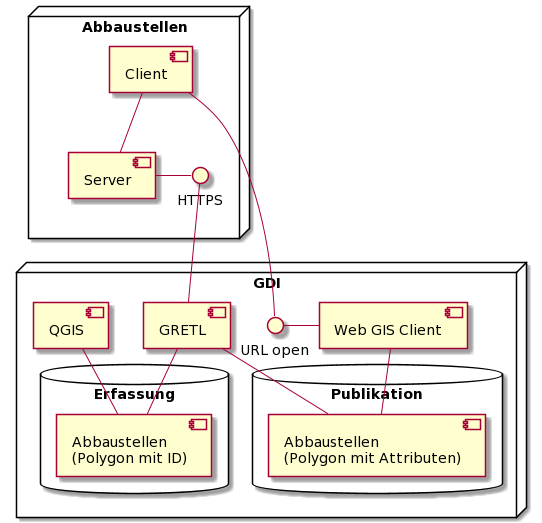

# p-abbaustellen

## Überblick der Systemintegration

## Verknüpfen der Sach- und Geometriedaten 

Beim Import der Sachdaten in die Geodatenbank soll sichergestellt werden, dass es weder Geometrien ohne Sachdaten-Objekt, noch Sachdaten-Objekte ohne Geometrien gibt.

Idealerweise nutzt der Import dabei die in den INTERLIS-Tools dafür bereits vorhandenen Mechanismen. Ein Weg mittels IliValidator ist in <http://blog.sogeo.services/blog/2020/09/23/interlis-leicht-gemacht-number-21.html> beschrieben.

Fragen Claude:

* Bemerkungen / Ergänzungen zum beschriebenen Weg
* Muss zusätzlich der IliValidator eingesetzt werden, oder reicht der Einsatz von ili2pg?
* Was gilt es zu beachten?
    * Baskets
    * Topics
    * Foreign Keys
    * Wie die Sachdaten-Objekte bei jedem Import komplett löschen und wieder einfügen? Möglichst transaktional - Sprich Abbruch des Löschens mit Fehlermeldung, falls die Referenzen nicht stimmen.

Fragen Markus:

* Arbeitsablauf: Copy-Paste der Polygon-ID von QGIS nach Abbaustellen
* Multipolygone?
* Ein "Knopf", welcher gleich auch publiziert, oder?

