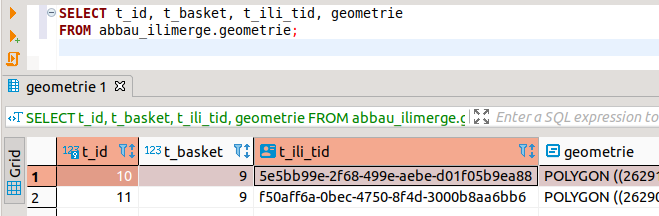

# Test mit dangling references

## Test setup

Um zu prüfen, ob unser Verständnis bezüglich externer Referenzen sowie der Prüfung beim Import richtig sind, wurde das folgende setup erstellt:
* Modell SO_AGI_MERGETEST (in model.ili) mit den zwei Klassen Geometrie und Abbaustelle
* Geometrietabelle umfasst zwei Polygone
* Importversuch mit 2, 1 und 3 Abbaustellen-Objekten

### Inhalt der Geometrietabelle

Die Geometrietabelle umfasst zwei Polygone - siehe [geodata_exported.xtf](geodata_exported.xtf)

Screenshot DB-Select:

## Import 1 (mit 2 Abbaustellen-Objekten)

Verwendung des xtf appdata_app2geo2.xtf

Wie erwartet flutschen die Daten rein, da die beiden Tabellen je zwei Objekte enthalten und die Referenzen stimmen:

    bjsvwjek@JOS:~/code/p-abbaustellen/ilimerge$ ./appimport.sh 
    Info: dburl <jdbc:postgresql://localhost:5432/postgres>
    Info: dbusr <postgres>
    WARNING: An illegal reflective access operation has occurred
    WARNING: Illegal reflective access by org.postgresql.jdbc.TimestampUtils (file:/home/bjsvwjek/tools/ili2pg-4.3.1/libs/postgresql-42.1.4.jre6.jar) to field java.util.TimeZone.defaultTimeZone
    WARNING: Please consider reporting this to the maintainers of org.postgresql.jdbc.TimestampUtils
    WARNING: Use --illegal-access=warn to enable warnings of further illegal reflective access operations
    WARNING: All illegal access operations will be denied in a future release
    Info: ili2pg-4.3.1-23b1f79e8ad644414773bb9bd1a97c8c265c5082
    Info: ili2c-5.0.2-20190906
    Info: iox-ili-1.20.13-0e35e7a59192f24b5deaf800127552d05ea64efb
    Info: java.version 11.0.10
    Info: user.name <bjsvwjek>
    Info: maxMemory 4073472 KB
    Info: currentTime 2021-06-01 15:48:37
    Info: dbschema <abbau_ilimerge>
    Info: dburl <jdbc:postgresql://localhost:5432/postgres>
    Info: dbusr <postgres>
    Info: databaseProduct <PostgreSQL>
    Info: databaseVersion <11.11>
    Info: driverName <PostgreSQL JDBC Driver>
    Info: driverVersion <42.1.4.jre6>
    Info: postGISVersion <POSTGIS="2.5.5" [EXTENSION] PGSQL="110" GEOS="3.8.1-CAPI-1.13.3" PROJ="Rel. 7.1.1, September 1st, 2020" GDAL="GDAL 3.1.4, released 2020/10/20" LIBXML="2.9.10" LIBJSON="0.15" LIBPROTOBUF="1.3.3" TOPOLOGY RASTER>
    Info: compile models...
    Info: lookup model <CoordSys> in repository <jdbc:postgresql://localhost:5432/postgres/abbau_ilimerge/>
    Info: lookup model <Units> 2.3 in repository <jdbc:postgresql://localhost:5432/postgres/abbau_ilimerge/>
    Info: lookup model <GeometryCHLV03_V1> 2.3 in repository <jdbc:postgresql://localhost:5432/postgres/abbau_ilimerge/>
    Info: lookup model <SO_AGI_MERGETEST> 2.3 in repository <jdbc:postgresql://localhost:5432/postgres/abbau_ilimerge/>
    Info: ilifile </home/bjsvwjek/.ilicache/jdbc&003apostgresql&003a/localhost&003a5432/postgres/abbau_ilimerge/Units-20120220.ili>
    Info: ilifile </home/bjsvwjek/.ilicache/jdbc&003apostgresql&003a/localhost&003a5432/postgres/abbau_ilimerge/CoordSys-20151124.ili>
    Info: ilifile </home/bjsvwjek/.ilicache/jdbc&003apostgresql&003a/localhost&003a5432/postgres/abbau_ilimerge/CHBase_Part1_GEOMETRY_V1.ili>
    Info: ilifile </home/bjsvwjek/.ilicache/jdbc&003apostgresql&003a/localhost&003a5432/postgres/abbau_ilimerge/model.ili>
    Info: process data file...
    Info: data </home/bjsvwjek/code/p-abbaustellen/ilimerge/appdata_app2geo2.xtf>
    Info: assume unknown external objects
    Info: first validation pass...
    Info: Basket SO_AGI_MERGETEST.Abbaustellen(oid bX)...
    Info: second validation pass...
    Info: validate target of role SO_AGI_MERGETEST.Abbaustellen.Abbaustelle_Geometrie.Geometrie...
    Info: validate multiplicity of role SO_AGI_MERGETEST.Abbaustellen.Abbaustelle_Geometrie.Geometrie...
    Info: appdata_app2geo2.xtf: SO_AGI_MERGETEST.Abbaustellen BID=bX
    Info:       2 objects in CLASS SO_AGI_MERGETEST.Abbaustellen.Abbaustelle
    Info: ...replace done

## Import 2 (mit 1 Abbaustellen-Objekt)

Der Import läuft durch, obwohl nach dem Import eine Geometrie-Objekt auf kein Abbaustellen-Objekt referenziert:

    bjsvwjek@JOS:~/code/p-abbaustellen/ilimerge$ ./appimport.sh 
    Info: dburl <jdbc:postgresql://localhost:5432/postgres>
    Info: dbusr <postgres>
    WARNING: An illegal reflective access operation has occurred
    WARNING: Illegal reflective access by org.postgresql.jdbc.TimestampUtils (file:/home/bjsvwjek/tools/ili2pg-4.3.1/libs/postgresql-42.1.4.jre6.jar) to field java.util.TimeZone.defaultTimeZone
    WARNING: Please consider reporting this to the maintainers of org.postgresql.jdbc.TimestampUtils
    WARNING: Use --illegal-access=warn to enable warnings of further illegal reflective access operations
    WARNING: All illegal access operations will be denied in a future release
    Info: ili2pg-4.3.1-23b1f79e8ad644414773bb9bd1a97c8c265c5082
    Info: ili2c-5.0.2-20190906
    Info: iox-ili-1.20.13-0e35e7a59192f24b5deaf800127552d05ea64efb
    Info: java.version 11.0.10
    Info: user.name <bjsvwjek>
    Info: maxMemory 4073472 KB
    Info: currentTime 2021-06-01 15:50:32
    Info: dbschema <abbau_ilimerge>
    Info: dburl <jdbc:postgresql://localhost:5432/postgres>
    Info: dbusr <postgres>
    Info: databaseProduct <PostgreSQL>
    Info: databaseVersion <11.11>
    Info: driverName <PostgreSQL JDBC Driver>
    Info: driverVersion <42.1.4.jre6>
    Info: postGISVersion <POSTGIS="2.5.5" [EXTENSION] PGSQL="110" GEOS="3.8.1-CAPI-1.13.3" PROJ="Rel. 7.1.1, September 1st, 2020" GDAL="GDAL 3.1.4, released 2020/10/20" LIBXML="2.9.10" LIBJSON="0.15" LIBPROTOBUF="1.3.3" TOPOLOGY RASTER>
    Info: compile models...
    Info: lookup model <CoordSys> in repository <jdbc:postgresql://localhost:5432/postgres/abbau_ilimerge/>
    Info: lookup model <Units> 2.3 in repository <jdbc:postgresql://localhost:5432/postgres/abbau_ilimerge/>
    Info: lookup model <GeometryCHLV03_V1> 2.3 in repository <jdbc:postgresql://localhost:5432/postgres/abbau_ilimerge/>
    Info: lookup model <SO_AGI_MERGETEST> 2.3 in repository <jdbc:postgresql://localhost:5432/postgres/abbau_ilimerge/>
    Info: ilifile </home/bjsvwjek/.ilicache/jdbc&003apostgresql&003a/localhost&003a5432/postgres/abbau_ilimerge/CoordSys-20151124.ili>
    Info: ilifile </home/bjsvwjek/.ilicache/jdbc&003apostgresql&003a/localhost&003a5432/postgres/abbau_ilimerge/Units-20120220.ili>
    Info: ilifile </home/bjsvwjek/.ilicache/jdbc&003apostgresql&003a/localhost&003a5432/postgres/abbau_ilimerge/CHBase_Part1_GEOMETRY_V1.ili>
    Info: ilifile </home/bjsvwjek/.ilicache/jdbc&003apostgresql&003a/localhost&003a5432/postgres/abbau_ilimerge/model.ili>
    Info: process data file...
    Info: data </home/bjsvwjek/code/p-abbaustellen/ilimerge/appdata_app1geo2.xtf>
    Info: assume unknown external objects
    Info: first validation pass...
    Info: Basket SO_AGI_MERGETEST.Abbaustellen(oid bX)...
    Info: second validation pass...
    Info: validate target of role SO_AGI_MERGETEST.Abbaustellen.Abbaustelle_Geometrie.Geometrie...
    Info: validate multiplicity of role SO_AGI_MERGETEST.Abbaustellen.Abbaustelle_Geometrie.Geometrie...
    Info: appdata_app1geo2.xtf: SO_AGI_MERGETEST.Abbaustellen BID=bX
    Info:       1 objects in CLASS SO_AGI_MERGETEST.Abbaustellen.Abbaustelle
    Info: ...replace done

## Import 3 (mit 3 Abbaustellen-Objekten)

Der Import wird wie erwartet abgebrochen, da ein Abbaustellen-Objekt kein Geometrie-Objekt referenziert:

    bjsvwjek@JOS:~/code/p-abbaustellen/ilimerge$ ./appimport.sh 
    Info: dburl <jdbc:postgresql://localhost:5432/postgres>
    Info: dbusr <postgres>
    WARNING: An illegal reflective access operation has occurred
    WARNING: Illegal reflective access by org.postgresql.jdbc.TimestampUtils (file:/home/bjsvwjek/tools/ili2pg-4.3.1/libs/postgresql-42.1.4.jre6.jar) to field java.util.TimeZone.defaultTimeZone
    WARNING: Please consider reporting this to the maintainers of org.postgresql.jdbc.TimestampUtils
    WARNING: Use --illegal-access=warn to enable warnings of further illegal reflective access operations
    WARNING: All illegal access operations will be denied in a future release
    Info: ili2pg-4.3.1-23b1f79e8ad644414773bb9bd1a97c8c265c5082
    Info: ili2c-5.0.2-20190906
    Info: iox-ili-1.20.13-0e35e7a59192f24b5deaf800127552d05ea64efb
    Info: java.version 11.0.10
    Info: user.name <bjsvwjek>
    Info: maxMemory 4073472 KB
    Info: currentTime 2021-06-01 15:54:23
    Info: dbschema <abbau_ilimerge>
    Info: dburl <jdbc:postgresql://localhost:5432/postgres>
    Info: dbusr <postgres>
    Info: databaseProduct <PostgreSQL>
    Info: databaseVersion <11.11>
    Info: driverName <PostgreSQL JDBC Driver>
    Info: driverVersion <42.1.4.jre6>
    Info: postGISVersion <POSTGIS="2.5.5" [EXTENSION] PGSQL="110" GEOS="3.8.1-CAPI-1.13.3" PROJ="Rel. 7.1.1, September 1st, 2020" GDAL="GDAL 3.1.4, released 2020/10/20" LIBXML="2.9.10" LIBJSON="0.15" LIBPROTOBUF="1.3.3" TOPOLOGY RASTER>
    Info: compile models...
    Info: lookup model <CoordSys> in repository <jdbc:postgresql://localhost:5432/postgres/abbau_ilimerge/>
    Info: lookup model <Units> 2.3 in repository <jdbc:postgresql://localhost:5432/postgres/abbau_ilimerge/>
    Info: lookup model <GeometryCHLV03_V1> 2.3 in repository <jdbc:postgresql://localhost:5432/postgres/abbau_ilimerge/>
    Info: lookup model <SO_AGI_MERGETEST> 2.3 in repository <jdbc:postgresql://localhost:5432/postgres/abbau_ilimerge/>
    Info: ilifile </home/bjsvwjek/.ilicache/jdbc&003apostgresql&003a/localhost&003a5432/postgres/abbau_ilimerge/Units-20120220.ili>
    Info: ilifile </home/bjsvwjek/.ilicache/jdbc&003apostgresql&003a/localhost&003a5432/postgres/abbau_ilimerge/CoordSys-20151124.ili>
    Info: ilifile </home/bjsvwjek/.ilicache/jdbc&003apostgresql&003a/localhost&003a5432/postgres/abbau_ilimerge/CHBase_Part1_GEOMETRY_V1.ili>
    Info: ilifile </home/bjsvwjek/.ilicache/jdbc&003apostgresql&003a/localhost&003a5432/postgres/abbau_ilimerge/model.ili>
    Info: process data file...
    Info: data </home/bjsvwjek/code/p-abbaustellen/ilimerge/appdata_app3geo2.xtf>
    Info: assume unknown external objects
    Info: first validation pass...
    Info: Basket SO_AGI_MERGETEST.Abbaustellen(oid bX)...
    Info: second validation pass...
    Info: validate target of role SO_AGI_MERGETEST.Abbaustellen.Abbaustelle_Geometrie.Geometrie...
    Info: validate multiplicity of role SO_AGI_MERGETEST.Abbaustellen.Abbaustelle_Geometrie.Geometrie...
    Error: unknown referenced object SO_AGI_MERGETEST.Abbaustellen.Geometrie TID 960073f1-da44-48f0-8d8c-75bf79ea1d38 referenced from SO_AGI_MERGETEST.Abbaustellen.Abbaustelle TID 1d18b917-6eb8-4dc5-84f6-10dc63b52a21
    Error: failed to transfer data from file to db
    Error:   dangling references
    ...replace failed

## Fragen

* Ist etwas an der Übungsanlage nicht korrekt?
* Wie muss vorgegangen werden, damit auch der Import mit einem Abbaustellen-Objekt eine "dangling reference" reklamiert und abbricht?

## Antworten

Die Übungsanlage zeigt anschaulich, dass sich die Validierungen des ilivalidator und von ili2pg unterscheiden.

* Import 3 bricht ab, da der FK auf der Datenbank nicht erfüllt wird
* Import 1 bricht nicht ab, da für die eingeschränkte Sicht der Datenbank hier alles in Ordnung zu sein scheint (referentielle Integrität auf der DB ist nicht verletzt)

Bei der vollen Validierung mit zwei Datenfiles ([validate.sh](validate.sh)) wird bei der Datenkonstellation von Import 1 wie erwartet der entsprechende Fehler angegeben:

    bjsvwjek@JOS:~/code/p-abbaustellen/ilimerge$ ./validate.sh 
    Info: ilivalidator-1.11.10-61c230a3331fd24f2c1dc841ee9519e191915440
    Info: ili2c-5.2.2-c48675a2ecb4cf824bcbdcaa76abfdb10bea327e
    Info: iox-ili-1.21.6-4c681c10b36fc582a611709d0ee9bf426177876f
    Info: User <bjsvwjek>
    Info: Start date 2021-06-14 14:57
    Info: maxMemory 4073472 KB
    Info: dataFile </home/bjsvwjek/code/p-abbaustellen/ilimerge/geodata_exported.xtf>
    Info: dataFile </home/bjsvwjek/code/p-abbaustellen/ilimerge/appdata_app1geo2.xtf>
    Info: pluginFolder </home/bjsvwjek/tools/ilivalidator-1.11.10/plugins>
    Info: modeldir <%ITF_DIR;http://models.interlis.ch/;%JAR_DIR/ilimodels>
    Info: lookup model <Units> 2.3 in repository </home/bjsvwjek/code/p-abbaustellen/ilimerge/>
    Info: lookup model <Units> 2.3 in repository <http://models.interlis.ch/>
    Info: lookup model <CoordSys> 2.3 in repository </home/bjsvwjek/code/p-abbaustellen/ilimerge/>
    Info: lookup model <CoordSys> 2.3 in repository <http://models.interlis.ch/>
    Info: lookup model <GeometryCHLV03_V1> 2.3 in repository </home/bjsvwjek/code/p-abbaustellen/ilimerge/>
    Info: lookup model <GeometryCHLV03_V1> 2.3 in repository <http://models.interlis.ch/>
    Info: lookup model <GeometryCHLV03_V1> 2.3 in repository </home/bjsvwjek/tools/ilivalidator-1.11.10/ilimodels/>
    Warning: Folder /home/bjsvwjek/tools/ilivalidator-1.11.10/ilimodels doesn't exist; ignored
    Info: lookup model <GeometryCHLV03_V1> 2.3 in repository <http://models.geo.admin.ch/>
    Info: lookup model <SO_AGI_MERGETEST> 2.3 in repository </home/bjsvwjek/code/p-abbaustellen/ilimerge/>
    Info: ilifile </home/bjsvwjek/.ilicache/models.interlis.ch/refhb23/Units-20120220.ili>
    Info: ilifile </home/bjsvwjek/.ilicache/models.interlis.ch/refhb23/CoordSys-20151124.ili>
    Info: ilifile </home/bjsvwjek/.ilicache/models.geo.admin.ch/CH/CHBase_Part1_GEOMETRY_V1.ili>
    Info: ilifile </home/bjsvwjek/code/p-abbaustellen/ilimerge/model.ili>
    Info: validate data...
    Info: assume unknown external objects
    Info: first validation pass...
    Info: first validation pass...
    Info: second validation pass...
    Info: validate multiplicity of role SO_AGI_MERGETEST.Abbaustellen.Abbaustelle_Geometrie.Abbaustelle...
    Error: line 6: SO_AGI_MERGETEST.Abbaustellen.Geometrie: tid f50aff6a-0bec-4750-8f4d-3000b8aa6bb6: Abbaustelle should associate 1 to 1 target objects (instead of 0)
    Info: validate target of role SO_AGI_MERGETEST.Abbaustellen.Abbaustelle_Geometrie.Geometrie...
    Info: validate multiplicity of role SO_AGI_MERGETEST.Abbaustellen.Abbaustelle_Geometrie.Geometrie...
    Info: /home/bjsvwjek/code/p-abbaustellen/ilimerge/appdata_app1geo2.xtf: SO_AGI_MERGETEST.Abbaustellen BID=bX
    Info:       1 objects in CLASS SO_AGI_MERGETEST.Abbaustellen.Abbaustelle
    Info: /home/bjsvwjek/code/p-abbaustellen/ilimerge/geodata_exported.xtf: SO_AGI_MERGETEST.Abbaustellen BID=9
    Info:       2 objects in CLASS SO_AGI_MERGETEST.Abbaustellen.Geometrie
    Info: ...validation failed

